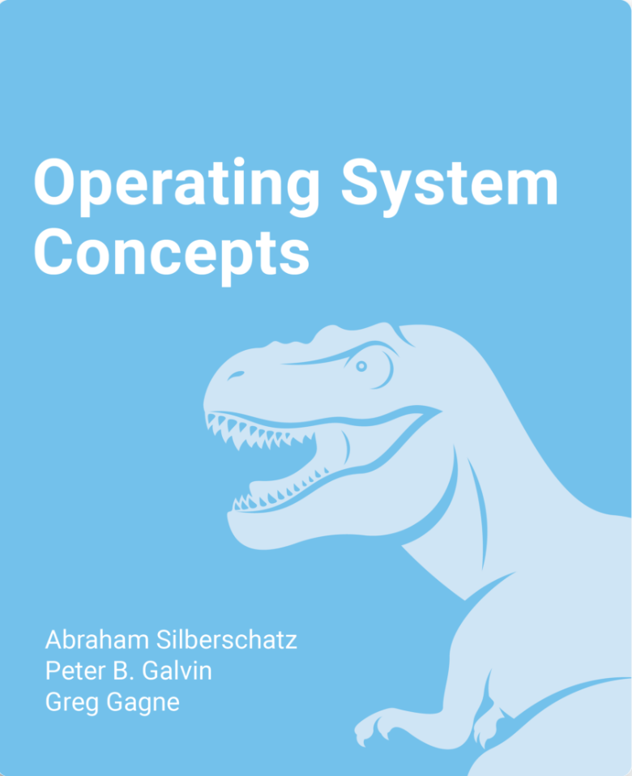

## Greg Gagne
### Professor / Computer Science
#### <a href="https://westminsteru.edu" target = "_blank" aria-label="Opens in new tab or window.">Westminster University</a> - Salt Lake City, Utah (US)

`ggagne (at-sign) westminsteru.edu`

Foster Hall 305

801.832.2361

**Office Hours** please contact me via email to arrange an appointment.

## Teaching

All courses are delivered via <a href="https://westminster.instructure.com" target="_blank" aria-label="Opens in new tab or window.">Westminster University's Canvas</a> site.

One of the joys and privileges of teaching at a small institution is the opportunity to teach a range of courses. I teach introductory programming classes in Python and Java through supervising senior capstone projects. I also teach computer networks, operating systems, computer security, and my favorite class - data structures. In addition to teaching computer science, I am also an affiliate faculty in the Honors Program at Westminster University where I teach courses that explore the intersectionality of science, power, and diversity.

## Books

I have been co-authoring the *Operating System Concepts* sequence with colleagues Avi Silberschatz and Pete Galvin where we are now in our tenth edition.

 
          <a href="https://www.zybooks.com/catalog/silberschatz-operating-system-concepts-10th-edition/" target="_blank" aria-label="Opens in new tab or window.">Operating System Concepts - Zybook Version </a>&nbsp;  
           
        
        
 
          <a href="https://codex.cs.yale.edu/avi/os-book/OS10/index.html" target="_blank" aria-label="Opens in new tab or window.">Operating System Concepts - Tenth Edition</a>&nbsp;  
           
        
        
 
          <a href="https://codex.cs.yale.edu/avi/os-book/OS10/index.html" target="_blank" aria-label="Opens in new tab or window.">Operating System Concepts Essentials</a>&nbsp;  
           
        
        

Maybe we aren't writing <a href="./os-books.JPG" target="_blank" aria-label="Opens in new tab or window.">the right kind</a> of operating system books!

